# Gas City: Visualization & Interaction Design

## How Gas City Maps to Gas Town (Zero New Infrastructure)

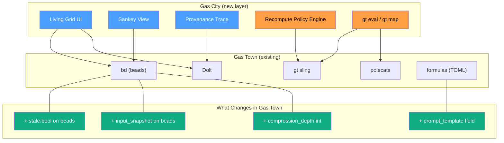

**Key point:** Gas City is a LENS on Gas Town, not a replacement. The
existing bead/formula/polecat infrastructure stays. We add 4 fields to
beads, a template field to formulas, and build the visualization +
policy layer on top.

## Iteration Model: Bounded Loops via Convergence

DAGs can't represent loops. But LLM workflows need iteration:
draft → review → revise → review → approve. Gas City handles this
via **bounded unrolling with convergence detection**.

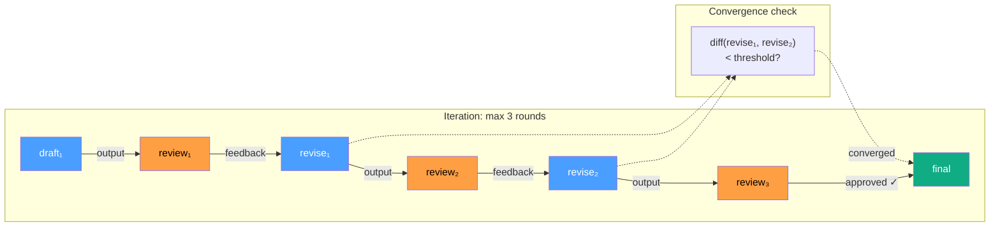

The loop is unrolled into a DAG with convergence gates. Each review
cell checks if the revision materially changed. If not → converged,
skip remaining rounds. The `convergent(maxRounds)` recomputation
policy enforces the bound.

## Architecture Overview

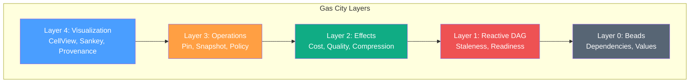

## The Seven Visualizations

### 1. The Living Grid

The primary view. Each cell shows its value, status, and metadata at a glance.

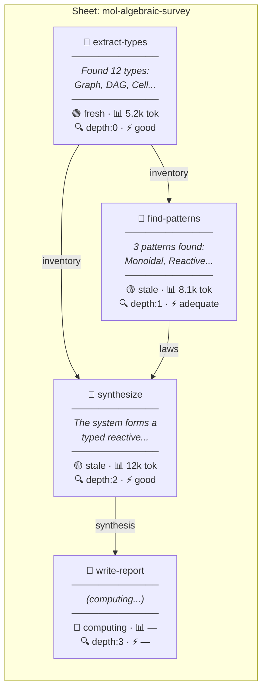

**Color key:**
- 🟢 Green border = fresh (up to date)
- 🟡 Amber border = stale (upstream changed)
- 🔵 Blue border = computing (LLM working)
- ⬜ Gray border = empty (never computed)
- 🔴 Red border = failed

### 2. The Information Sankey

Shows information narrowing through the pipeline. Width = token count.

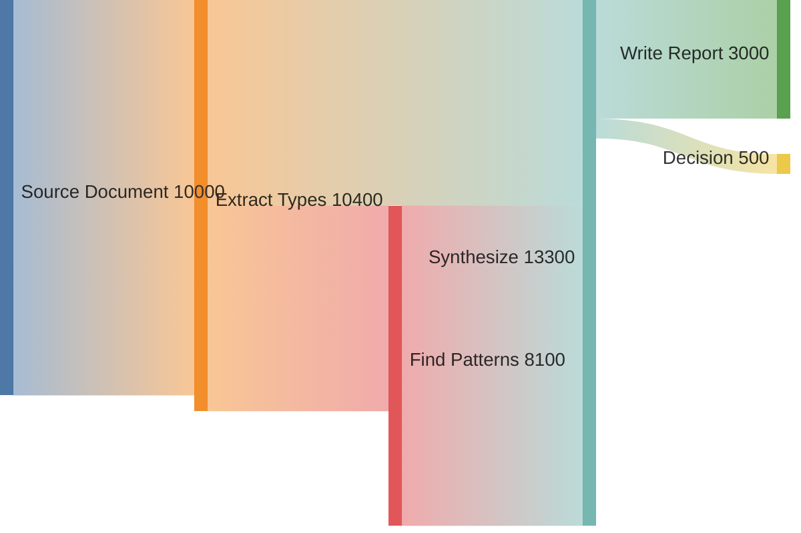

**What you SEE:** The 10,000-token source document narrows to a 500-token
decision. Each node is a compression step. The Sankey makes the funnel
visceral — you can immediately spot where the biggest information drops
happen.

**Interactive:** Hover a flow to see compression ratio. Click a node to
see the full cell output. Double-click to see the prompt template.

### 3. The Staleness Wave

Animated propagation when an upstream cell changes.

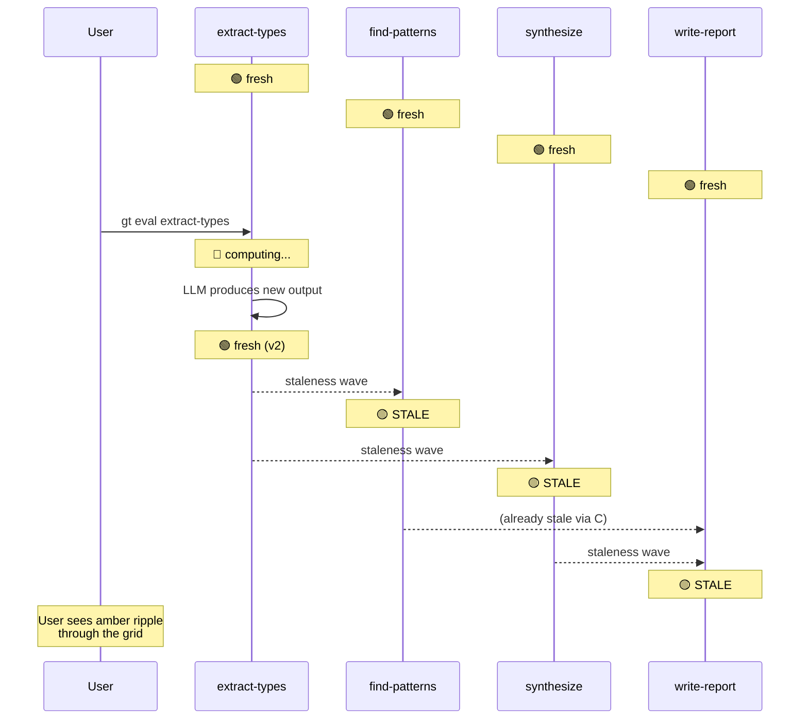

### 4. The Cost Flame Graph

Token expenditure as nested blocks. Width = tokens. Color = quality.

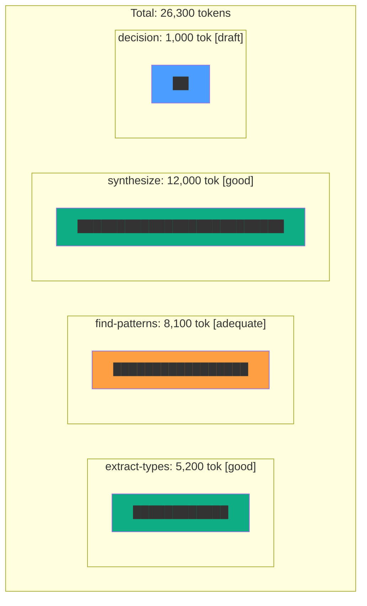

**Interactive:** Click a block to expand into sub-costs (prompt tokens vs
output tokens). Drag the quality slider to see how cost changes:
"What if I run synthesize at draft instead of good?"

### 5. The Compression Depth Heatmap

Topological view colored by how far each cell is from raw data.

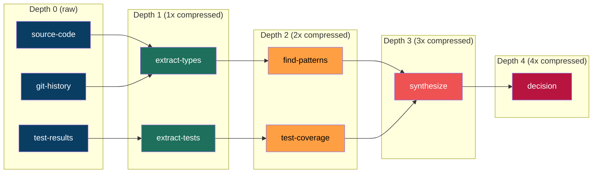

**What you SEE:** Cells go from cool blue (raw data, depth 0) to hot red
(heavily compressed, depth 4). When cell `decision` gives a wrong answer,
you immediately see: it's 4 compressions from reality. Trace backwards
through the cooling colors to find where critical information was dropped.

### 6. The Provenance Trace (View Precedents)

Click any cell → see where its information came from.

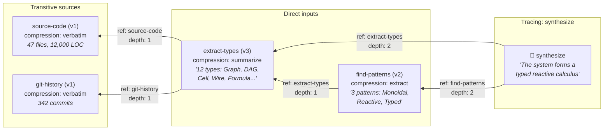

**Interactive:** Click on a specific SENTENCE in synthesize's output →
highlight which upstream content contributed to it. This is the
"View Precedents" (Ctrl+[) of the agent spreadsheet.

### 7. The Multiverse Diff

Re-run a cell, compare outputs side by side.

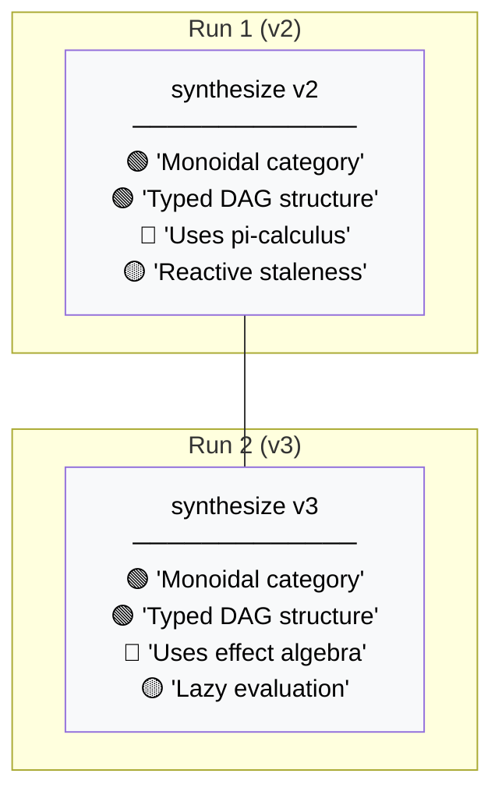

**Legend:** 🟢 Stable across runs (signal) · 🔴 Lost (was in v2, not v3) ·
🔵 Added (new in v3) · 🟡 Changed (present in both, different wording)

---

## The Interaction Model: Spreadsheet Operations → Gas City

### Cell Selection & Navigation

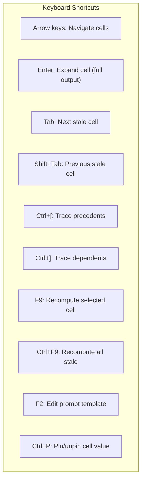

### The Pin & Rerun Workflow (Freeze Panes)

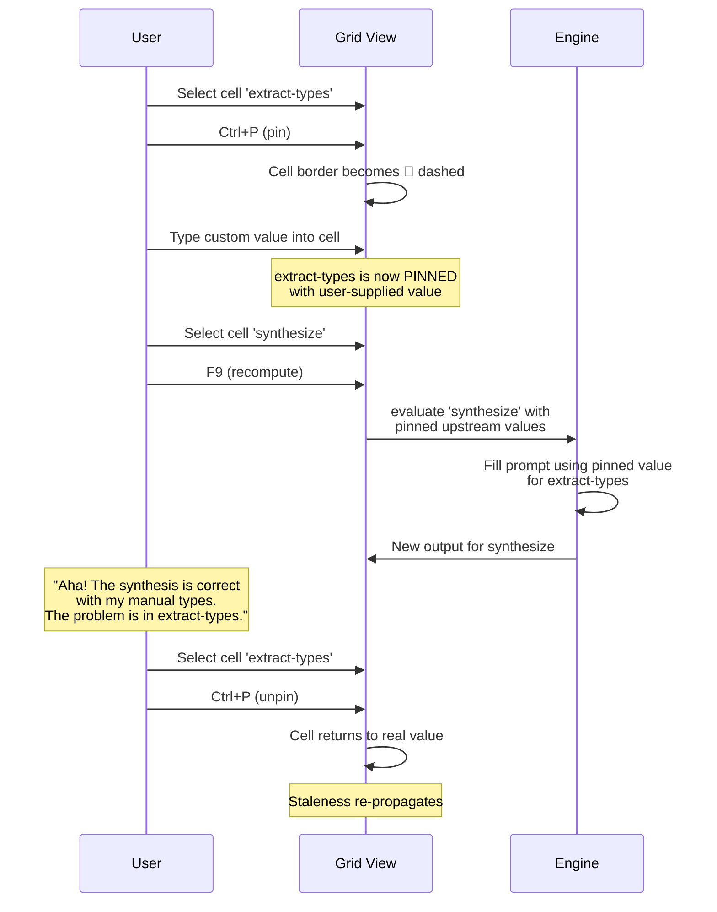

### The Map Operation (Drag to Fill)

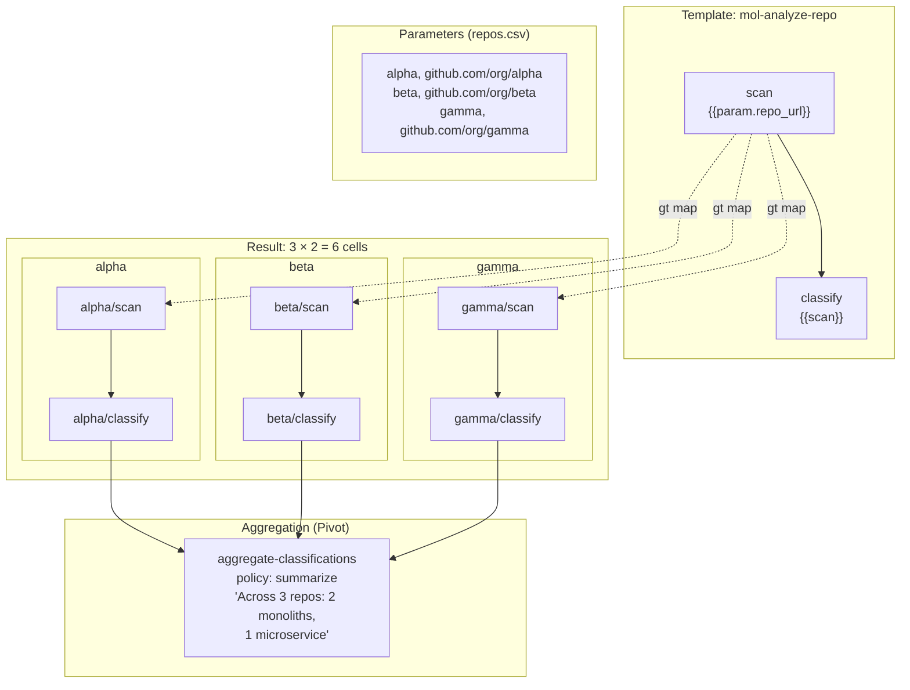

### Recomputation Policy Decision Tree

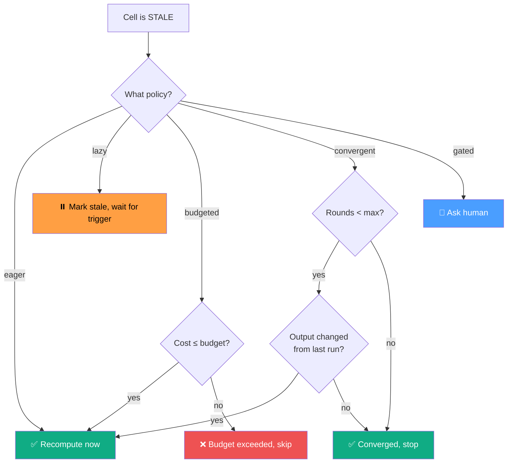

---

## Mockup: The Full Gas City UI

### Main View Layout

```
┌─────────────────────────────────────────────────────────────────┐
│ Gas City: mol-algebraic-survey                    [▶ Run All]   │
│ Budget: 45,000 tok remaining │ 4 fresh │ 2 stale │ 1 computing │
├────────────┬────────────────────────────────────────────────────┤
│            │                                                    │
│ FORMULA    │              LIVING GRID                           │
│ TREE       │                                                    │
│            │  ┌──────────┐    ┌──────────┐    ┌──────────┐     │
│ ▼ survey   │  │extract   │───▶│patterns  │───▶│synthesize│     │
│   extract  │  │──────────│    │──────────│    │──────────│     │
│   patterns │  │Found 12  │    │3 patterns│    │Typed     │     │
│   ▶synth.  │  │types:    │    │found:    │    │reactive  │     │
│   report   │  │Graph,DAG │    │Monoidal, │    │calculus  │     │
│   decision │  │Cell...   │    │Reactive..│    │with...   │     │
│            │  │──────────│    │──────────│    │──────────│     │
│ VIEWS      │  │🟢 5.2k  │    │🟡 8.1k  │    │🟡 12k   │     │
│ ○ Grid     │  │depth:0   │    │depth:1   │    │depth:2   │     │
│ ○ Sankey   │  └──────────┘    └──────────┘    └──────────┘     │
│ ○ Flame    │                        │                           │
│ ○ Heatmap  │                        ▼                           │
│ ○ Trace    │               ┌──────────────┐                    │
│            │               │write-report  │                    │
│ POLICY     │               │──────────────│                    │
│ ● lazy     │               │(computing...)│                    │
│ ○ eager    │               │──────────────│                    │
│ ○ budgeted │               │🔵 est: 15k  │                    │
│            │               │depth:3       │                    │
│            │               └──────────────┘                    │
├────────────┴────────────────────────────────────────────────────┤
│ PROMPT INSPECTOR (synthesize)                                   │
│ ┌──────────────────────────────────────────────────────────────┐│
│ │ Given the type inventory: [{{extract-types}}],               ││
│ │ and the patterns found: [{{find-patterns}}],                 ││
│ │ what algebraic structure does this system form?              ││
│ │                                                              ││
│ │ [{{extract-types}}] → links to cell, click to expand        ││
│ └──────────────────────────────────────────────────────────────┘│
└─────────────────────────────────────────────────────────────────┘
```

### Expanded Cell View

```
┌─────────────────────────────────────────────────────────────────┐
│ 📄 synthesize (v2)                          [📌 Pin] [🔄 Rerun]│
├─────────────────────────────────────────────────────────────────┤
│ STATUS: 🟡 stale (upstream extract-types changed)              │
│ COST: 12,000 tokens │ QUALITY: good │ DEPTH: 2                 │
│ AGENT: gastown/polecats/rictus │ MODEL: claude-sonnet-4-6      │
│ COMPUTED: 2026-03-08 14:23:07 UTC                              │
│ INPUT SNAPSHOT:                                                 │
│   extract-types v3 (current: v4 ⚠️)                            │
│   find-patterns v2 (current: v2 ✓)                             │
├─────────────────────────────────────────────────────────────────┤
│ OUTPUT:                                                         │
│                                                                 │
│ The system forms a typed reactive calculus with the following   │
│ algebraic structure:                                            │
│                                                                 │
│ 1. A monoidal category where cells are objects and typed       │
│    wires are morphisms. Composition is well-typed by the       │
│    port compatibility predicate.                                │
│                                                                 │
│ 2. An effect monoid tracking cost (tokens) and quality         │
│    (draft < adequate < good < excellent) with proven           │
│    composition laws.                                            │
│ [...]                                                           │
├─────────────────────────────────────────────────────────────────┤
│ HISTORY: v1 (draft) → v2 (good)                                │
│ COMPRESSION: summarize (from 13,300 tok input → 3,200 tok out) │
│ PROVENANCE: ← extract-types ← source-code, git-history        │
└─────────────────────────────────────────────────────────────────┘
```

### Sankey Detail View

```
┌─────────────────────────────────────────────────────────────────┐
│ INFORMATION FLOW: mol-algebraic-survey                          │
│                                                                 │
│ source-code ████████████████████████████████████████  47,000 tok│
│              ╲                                                  │
│               ╲ [extract: types]                                │
│                ╲                                                │
│ extract-types   ████████████  5,200 tok  (ratio: 9:1)          │
│                  ╲     ╲                                        │
│                   ╲     ╲ [extract: patterns]                   │
│                    ╲     ╲                                      │
│ find-patterns       ╲    ████████████████  8,100 tok            │
│                      ╲        ╱                                 │
│                       ╲      ╱ [summarize]                      │
│                        ╲    ╱                                   │
│ synthesize              ██████  3,200 tok  (ratio: 4:1)        │
│                           ╲                                     │
│                            ╲ [decide]                           │
│                             ╲                                   │
│ decision                     █  500 tok  (ratio: 6:1)          │
│                                                                 │
│ TOTAL: 47,000 → 500  (overall ratio: 94:1)                    │
│ BOTTLENECK: extract-types (9:1 — most information dropped here)│
└─────────────────────────────────────────────────────────────────┘
```

---

## Feynman Diagrams for Agent Computation

### Tree-Level: Simple Feed-Forward

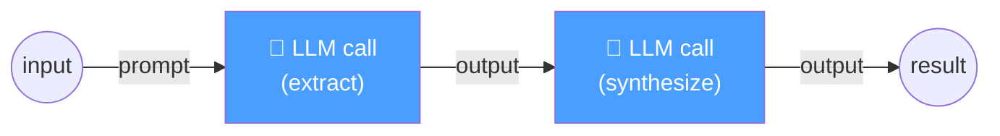

**Cost:** 2 LLM calls. No loops. This is the "Born approximation" —
the cheapest computation that produces any answer.

### One-Loop: Single Review Cycle

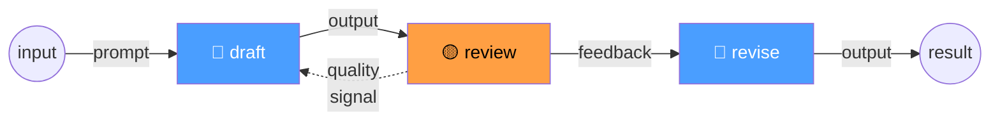

**Cost:** 3 LLM calls. The loop adds a "correction" to the tree-level
answer. Like a one-loop Feynman diagram, this is the first perturbative
correction — more expensive but more accurate.

### Two-Loop: Draft → Review → Revise → Review → Final

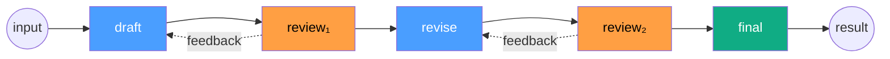

**The perturbation series analogy:** Each loop improves quality but costs
more. The series converges — after enough review cycles, the answer
stabilizes (convergent recomputation policy). The art is knowing when to
truncate the series. In QED, higher-loop diagrams contribute less. In
agent computation, diminishing returns on review cycles.

### Fan-Out: Parallel Exploration

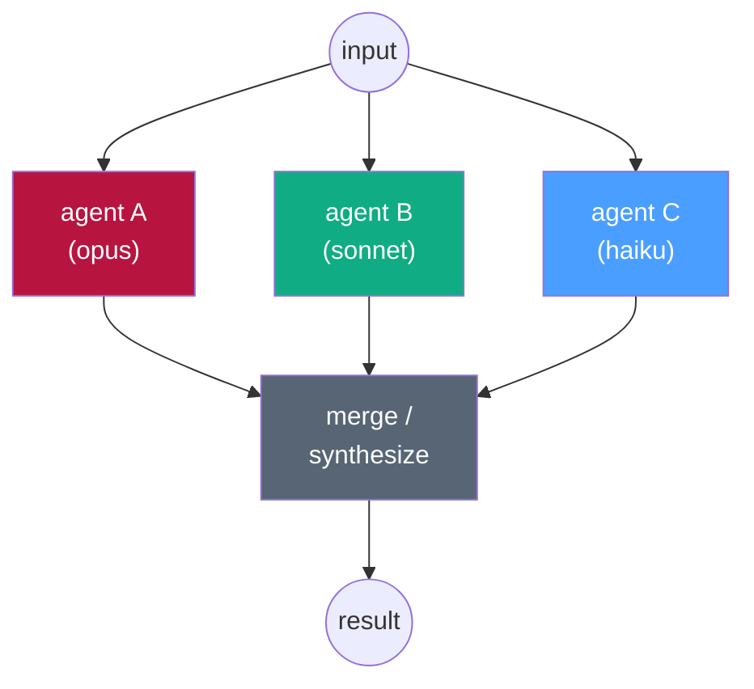

**Cost:** par(A, B, C) + merge. The parallel diagram is cheaper in
wall-clock time than running sequentially (par_le_seq). The merge
vertex is where information from different "paths" recombines — like
a vertex in a Feynman diagram where particles interact.

---

## State Machine: Cell Lifecycle

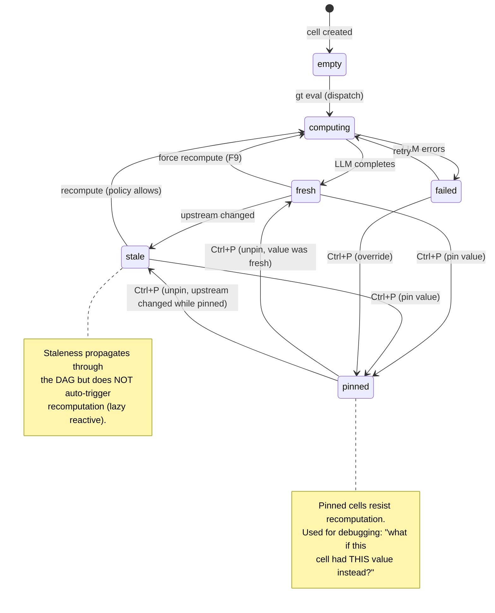

## Data Flow: Recomputation with Input Snapshots

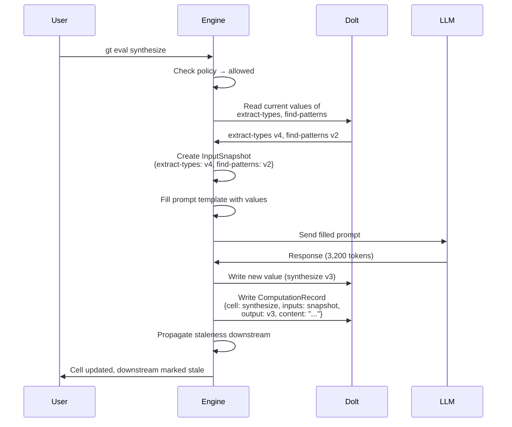

## The Complete Spreadsheet ↔ Gas City Operation Map

```mermaid
mindmap
    root((Gas City<br/>Operations))
        Direct Manipulation
            Click cell → expand
            Type value → pin
            Drag to connect → wire
            Delete wire → disconnect
        Navigation
            Arrow keys → move
            Tab → next stale
            Ctrl+[ → precedents
            Ctrl+] → dependents
            Ctrl+` → toggle formula/value
        Computation
            F9 → recompute cell
            Ctrl+F9 → recompute all stale
            Shift+F9 → recompute with budget
        Template
            F2 → edit prompt template
            gt map → fill down (parameterize)
            Copy cell → duplicate with new params
        Debugging
            Ctrl+P → pin/freeze cell
            Ctrl+Z → revert to previous version
            Diff view → compare runs
            Sankey view → see information flow
        Policy
            Set per-cell recompute policy
            Budget slider → cost control
            Quality dial → quality/cost tradeoff
            Convergence limit → max iterations
```

---

## Example Session: Debugging a Wrong Synthesis

A walkthrough of finding and fixing a problem using Gas City's tools.

### Step 1: Notice the Problem

```mermaid
graph LR
    A["extract-types<br/>🟢 v4"] --> C["synthesize<br/>🟢 v3<br/>❌ WRONG"]
    B["find-patterns<br/>🟢 v2"] --> C
    C --> D["decision<br/>🟢 v1"]

    style C fill:#ee5253,color:#fff
```

User sees synthesize has a wrong conclusion. Which input caused it?

### Step 2: Check Input Snapshot

Open the expanded cell view for synthesize. See:
- Input: extract-types **v4** (current: v4 ✓)
- Input: find-patterns **v2** (current: v2 ✓)

Both inputs are current. The problem is either in the inputs themselves
or in the synthesis prompt.

### Step 3: Pin and Rerun

```mermaid
sequenceDiagram
    participant U as User
    participant ET as extract-types
    participant SY as synthesize

    U->>ET: Ctrl+P → Pin with known-good value
    Note over ET: 📌 Pinned: "5 types: Graph, DAG,<br/>Cell, Wire, Formula"

    U->>SY: F9 → Recompute
    Note over SY: Uses pinned value from extract-types<br/>+ real value from find-patterns

    alt Synthesis is now correct
        Note over U: Problem was in extract-types v4!
        U->>ET: Ctrl+P → Unpin
        U->>ET: F9 → Recompute extract-types
    else Synthesis is still wrong
        Note over U: Problem is in the prompt template<br/>or in find-patterns
        U->>SY: F2 → Edit prompt template
    end
```

### Step 4: Trace the Sankey

Switch to Sankey view. See that extract-types compresses 47,000 tokens
to 5,200 (9:1 ratio). That's aggressive. The critical types might be
getting dropped in the compression.

**Fix:** Change extract-types' compression policy from `summarize` to
`extract` (structured data, higher fidelity). Recompute. Check if
synthesize now gets the right answer.

### Step 5: Verify with Multiverse Diff

Rerun synthesize three times. Compare outputs:
- Run 1: "monoidal category" ✅ stable
- Run 2: "effect algebra" ✅ stable
- Run 3: "pi-calculus model" ❌ volatile (appeared once, disappeared)

The volatile claim "pi-calculus model" is noise. The stable claims are
signal. The synthesis is now reliable.
