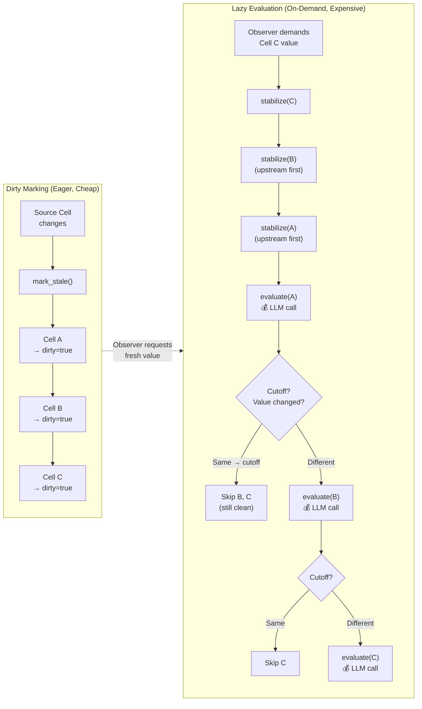
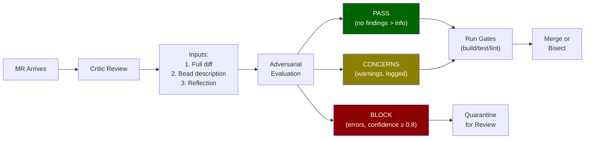

# Gas City: Full Stack Architecture Diagrams

**Source**: S3 Architecture Sketch (gt-5km) — Sections 6, 7, 9
**Date**: 2026-03-08

---

## 1. Four-Layer Stack

The Gas City stack is four architectural layers composed on top of Gas Town's
unchanged foundation.

```mermaid
block-beta
  columns 1

  block:city["GAS CITY"]
    columns 1

    block:l4["Layer 4: Protocol Membrane (DEFERRED)"]
      l4a["A2A Agent Cards"]
      l4b["MCP Tool Consumption"]
      l4c["Federation"]
    end

    block:l3["Layer 3: Quality Gate"]
      l3a["Critic Lens"]
      l3b["Adversarial Review"]
      l3c["PASS / CONCERNS / BLOCK"]
    end

    block:l2["Layer 2: Learning Pipeline"]
      l2a["Reflection Cycles"]
      l2b["Skill Crystals"]
      l2c["SQL Retrieval"]
    end

    block:l1["Layer 1: Reactive Dataflow Substrate"]
      l1a["Reactive Cells"]
      l1b["Computation DAGs"]
      l1c["Cutoff Predicates"]
    end
  end

  block:foundation["GAS TOWN FOUNDATION (UNCHANGED)"]
    columns 2
    f1["Beads"]
    f2["Formulas"]
    f3["Polecats"]
    f4["Mail"]
    f5["Dolt"]
    f6["Witness"]
    f7["Refinery"]
    f8["Mayor"]
  end

  style l4 fill:#444,stroke:#666,stroke-dasharray:5 5,color:#999
  style foundation fill:#1a3a1a,stroke:#2d5a2d
```

---

## 2. Cross-Layer Interactions

How the four Gas City layers interact with each other and with the Gas Town
foundation.

```mermaid
flowchart TB
    subgraph L4["Layer 4: Protocol Membrane (DEFERRED)"]
        A2A["A2A Agent Cards"]
        MCP["MCP Tools"]
        FED["Federation"]
    end

    subgraph L3["Layer 3: Quality Gate"]
        CRITIC["Critic Lens"]
        REVIEW["Review Beads"]
    end

    subgraph L2["Layer 2: Learning Pipeline"]
        REFLECT["Reflection Cycles"]
        CRYSTAL["Skill Crystals"]
        CONSOL["Consolidation"]
    end

    subgraph L1["Layer 1: Reactive Dataflow"]
        CELLS["Reactive Cells"]
        DAGS["Computation DAGs"]
        CUTOFF["Cutoff Predicates"]
    end

    subgraph GT["Gas Town Foundation"]
        BEADS["Beads"]
        FORMULAS["Formulas"]
        POLECATS["Polecats"]
        REFINERY["Refinery"]
        DOLT["Dolt"]
        PRIME["gt prime"]
    end

    %% Cross-layer: Reactive Cells <-> Critic Lens
    CRITIC -->|"BLOCK marks downstream cells stale"| CELLS
    CELLS -->|"Cell evaluator code reviewed"| CRITIC

    %% Cross-layer: Reflection <-> Crystals
    REFLECT -->|"Feeds crystal extraction"| CRYSTAL
    CRYSTAL -->|"References source reflections"| REFLECT
    CONSOL -->|"Identifies cross-reflection patterns"| CRYSTAL

    %% Cross-layer: DAGs <-> Reflections
    DAGS -->|"Step outputs feed reflection"| REFLECT
    REFLECT -.->|"Records DAG path taken, cutoffs, parallelism"| DAGS

    %% Cross-layer: Reactive Cells <-> DAGs
    DAGS -->|"Steps ARE cells"| CELLS
    CELLS -->|"Output change marks downstream steps stale"| DAGS

    %% Foundation connections
    CELLS -->|"dirty flag + cell_value columns"| BEADS
    DAGS -->|"inputs/outputs on formula steps"| FORMULAS
    REFLECT -->|"reflection JSON column"| BEADS
    CRYSTAL -->|"crystals table"| DOLT
    CRITIC -->|"Pre-gate review step"| REFINERY
    REFLECT -->|"Retrieval during prime"| PRIME
    CRYSTAL -->|"Matching during prime"| PRIME
    DAGS -->|"Parallel step dispatch"| POLECATS

    style L4 fill:#333,stroke:#555,stroke-dasharray:5 5,color:#aaa
    style GT fill:#1a3a1a,stroke:#2d5a2d
```

---

## 3. Reactive Dataflow Detail (Layer 1)

How dirty-marking and lazy evaluation work within the reactive cell system.

---

## 4. Critic Lens Pipeline (Layer 3)

How the Critic integrates into the Refinery merge queue.

---

## 5. Five-Phase Migration Timeline

Additive migration from Gas Town to Gas City. Each phase is independently
deployable and rollbackable.

```mermaid
gantt
    title Gas Town → Gas City Migration
    dateFormat X
    axisFormat Week %s

    section Phase 1: Learning Layer
    Reflection columns (beads)           :p1a, 1, 2w
    Reflect step in mol-polecat-work     :p1b, 1, 2w
    Retrieval in gt prime                :p1c, 1, 2w

    section Phase 2: Quality Gate
    Critic review step (Refinery)        :p2a, 3, 2w
    Reviews table + bd review            :p2b, 3, 2w
    Advisory mode calibration (50 MRs)   :p2c, 3, 2w

    section Phase 3: Reactive Foundation
    Reactive cell columns (beads)        :p3a, 5, 4w
    bd mark-stale / stabilize / cell     :p3b, 5, 4w
    Dirty propagation in bd write path   :p3c, 5, 4w

    section Phase 4: DAG Composition
    Formula inputs/outputs schema        :p4a, 9, 6w
    Topological scheduler                :p4b, 9, 6w
    Parallel step execution              :p4c, 9, 6w

    section Phase 5: Skill Crystals (Trial)
    Crystals table                       :p5a, 15, 4w
    bd crystal extract / match           :p5b, 15, 4w
    Crystal matching in gt prime         :p5c, 15, 4w
```

---

## 6. Migration Phase Details

```mermaid
flowchart TB
    subgraph P1["Phase 1: Learning Layer (Wk 1-2)"]
        P1A["+ reflection JSON column"]
        P1B["+ difficulty VARCHAR column"]
        P1C["+ reflect formula step"]
        P1D["+ retrieval in gt prime"]
    end

    subgraph P2["Phase 2: Quality Gate (Wk 3-4)"]
        P2A["+ Critic step in Refinery"]
        P2B["+ reviews table"]
        P2C["+ bd review show"]
        P2D["Advisory mode: 50 MR calibration"]
    end

    subgraph P3["Phase 3: Reactive Foundation (Wk 5-8)"]
        P3A["+ dirty, cell_value columns"]
        P3B["+ cell_evaluator, cutoff_mode"]
        P3C["+ reactive flag on dependencies"]
        P3D["+ bd mark-stale, stabilize, cell"]
    end

    subgraph P4["Phase 4: DAG Composition (Wk 9-14)"]
        P4A["+ inputs/outputs on formula steps"]
        P4B["+ topological scheduler"]
        P4C["+ parallel step execution"]
        P4D["+ bounded cycle unrolling"]
    end

    subgraph P5["Phase 5: Skill Crystals (Wk 15+, Trial)"]
        P5A["+ crystals table"]
        P5B["+ bd crystal extract"]
        P5C["+ bd crystal match"]
        P5D["+ crystal matching in gt prime"]
    end

    P1 -->|"Zero migration\nNULL defaults"| P2
    P2 -->|"Backwards-compatible\nMR processing"| P3
    P3 -->|"Safe defaults\ndirty=FALSE"| P4
    P4 -->|"Opt-in per formula\nLinear = unchanged"| P5

    style P1 fill:#1a3a5a,stroke:#2d5a8d
    style P2 fill:#3a1a5a,stroke:#5a2d8d
    style P3 fill:#5a3a1a,stroke:#8d5a2d
    style P4 fill:#1a5a3a,stroke:#2d8d5a
    style P5 fill:#5a1a3a,stroke:#8d2d5a
```

---

## 7. Excluded Features (What Gas City Does NOT Add)

Deliberate exclusions and their rationale.

```mermaid
flowchart TB
    subgraph EXCLUDED["Deliberately Excluded from Gas City"]
        direction TB

        PA["Persistent Agents"]
        VS["Vector Store"]
        AM["Agent Market"]
        PROTO["MCP/A2A Integration"]
        BG["Background Recomputation"]
    end

    subgraph RATIONALE["Rationale"]
        direction TB

        RA["Ephemeral agents avoid\nmemory corruption,\nidentity drift,\nresource leaks"]

        RV["Corpus too small for\nsemantic search.\nSQL queries suffice.\nDolt is a SQL database."]

        RM["Fleet size < 10.\nCentral dispatch\n(Mayor) works."]

        RP["Ecosystem still\nmaturing. Custom\nprotocols work\ninternally."]

        RB["Inverted cost model:\nlazy evaluation\nprevents runaway\nLLM costs."]
    end

    subgraph INSTEAD["Gas City Uses Instead"]
        direction TB

        IA["Reflections + Crystals\nprovide continuity\nwithout persistence"]

        IV["SQL keyword matching\non metadata queries"]

        IM["Mayor assigns work\nvia beads + mail"]

        IP["Thin HTTP adapter\n(designed, not built)"]

        IB["Demand-driven\nbd stabilize\n(observer pulls)"]
    end

    PA --- RA --- IA
    VS --- RV --- IV
    AM --- RM --- IM
    PROTO --- RP --- IP
    BG --- RB --- IB

    style EXCLUDED fill:#4a0000,stroke:#8b0000,color:#ff9999
    style RATIONALE fill:#333,stroke:#666
    style INSTEAD fill:#003a00,stroke:#006400,color:#99ff99
```

---

## 8. Composition Principle: Gas City Concepts Map to Gas Town Primitives

Every Gas City abstraction maps to existing Gas Town primitives with minimal
extensions — no new storage systems, coordination protocols, or process types.

```mermaid
flowchart LR
    subgraph GC["Gas City Concept"]
        C1["Reactive Cell"]
        C2["Computation DAG"]
        C3["Reflection"]
        C4["Skill Crystal"]
        C5["Critic Review"]
        C6["Protocol Endpoint"]
    end

    subgraph GT["Gas Town Implementation"]
        I1["Bead + dirty flag\n+ reactive_deps"]
        I2["Molecule + input/output\ndeclarations on steps"]
        I3["Structured bead fields\n+ formula step"]
        I4["Typed bead in\ncrystals table"]
        I5["Refinery\nformula step"]
        I6["Thin HTTP adapter\nover bd CLI"]
    end

    C1 --> I1
    C2 --> I2
    C3 --> I3
    C4 --> I4
    C5 --> I5
    C6 --> I6

    style GC fill:#1a3a5a,stroke:#2d5a8d
    style GT fill:#1a3a1a,stroke:#2d5a2d
```

