# Layer 1: Reactive Dataflow Substrate — Diagrams

**Source**: S3 Architecture Sketch §2.1 (Reactive Cells), §2.2 (Computation DAGs)

---

## 1. Reactive Cell Schema Extension

How Gas City extends the existing beads schema to support reactive computation.

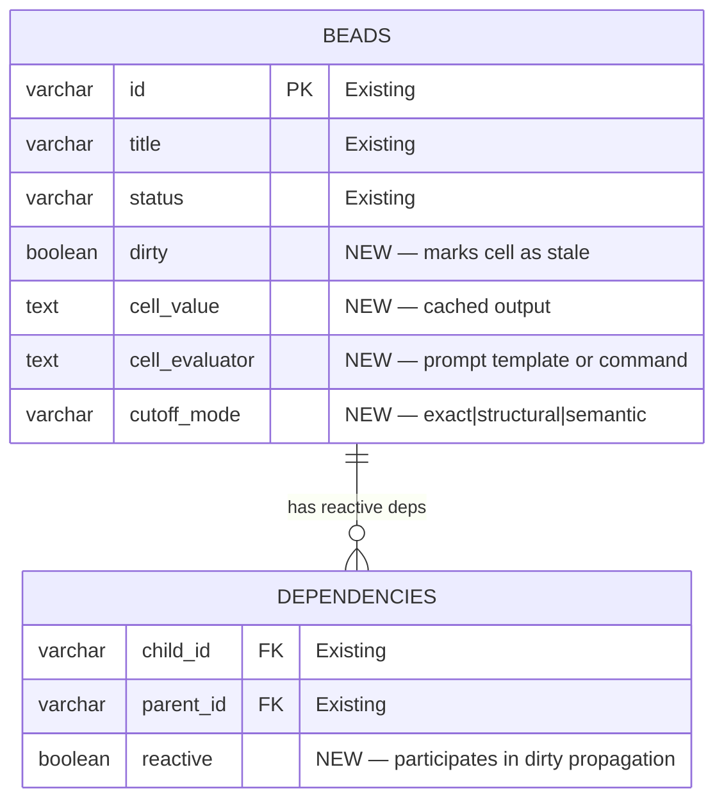

---

## 2. Dirty-Marking Propagation Through a DAG

When a source cell changes, dirty flags propagate eagerly through the entire
downstream graph. This is cheap (O(edges), no LLM calls).

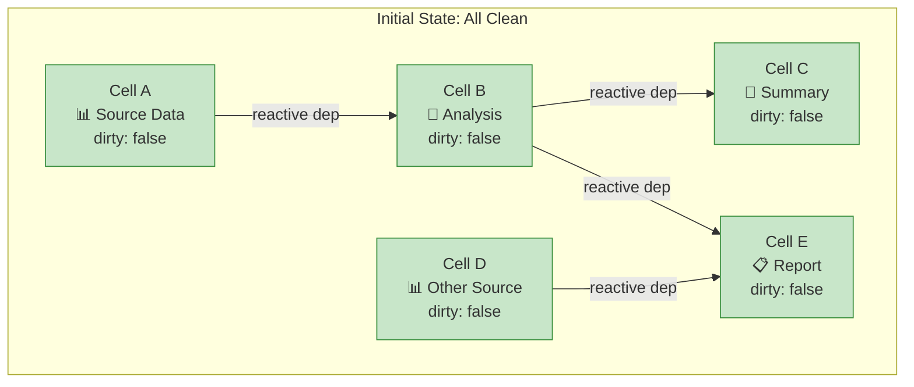

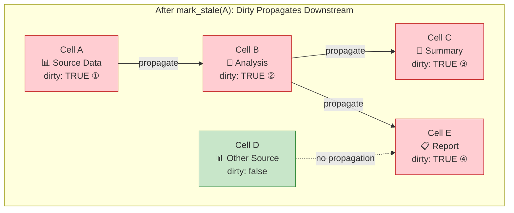

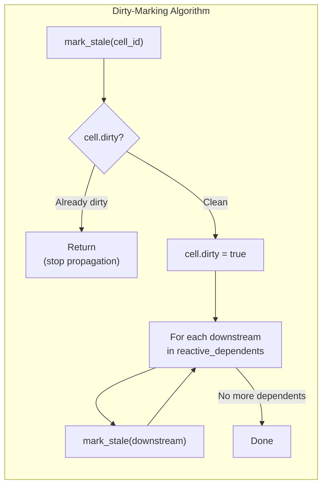

---

## 3. Lazy Evaluation (Stabilization) Flow

Recomputation only happens when an observer demands a fresh value via
`bd stabilize`. This is expensive (LLM calls) and follows the inverted
cost model.

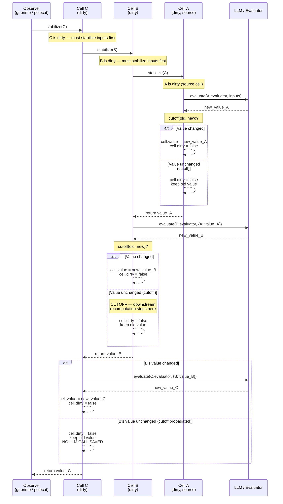

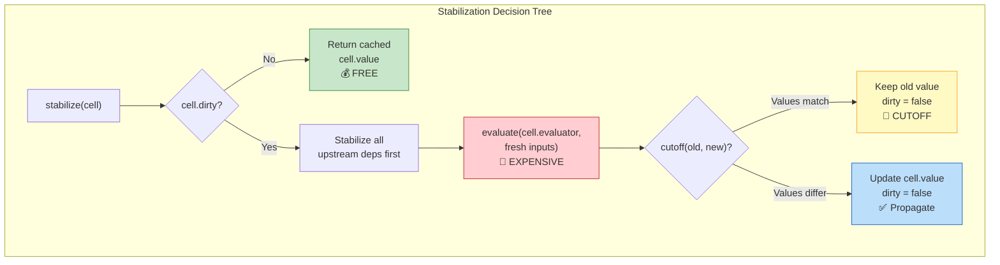

---

## 4. Cutoff Predicates

Three modes prevent unnecessary downstream recomputation. The choice trades
comparison cost against recomputation savings.

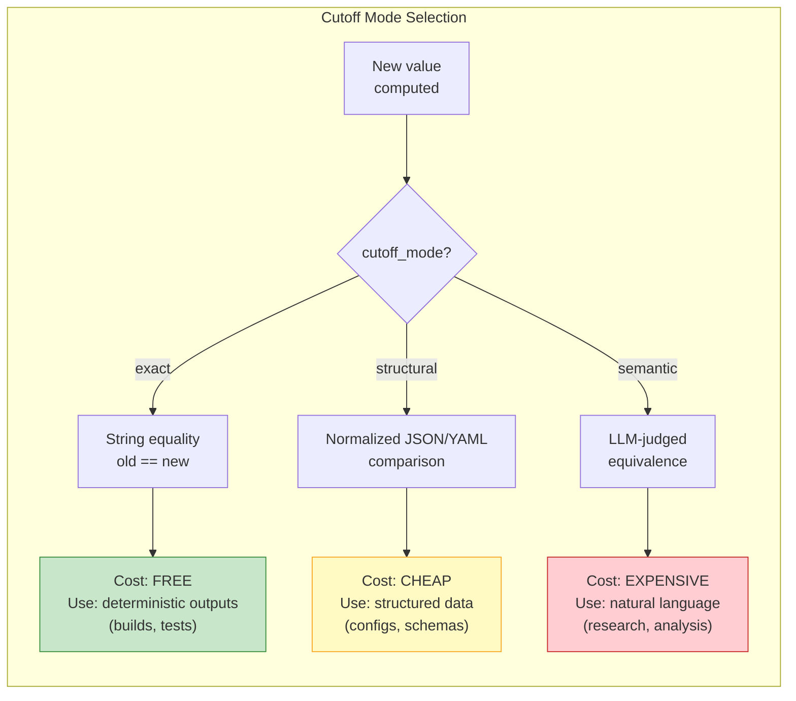

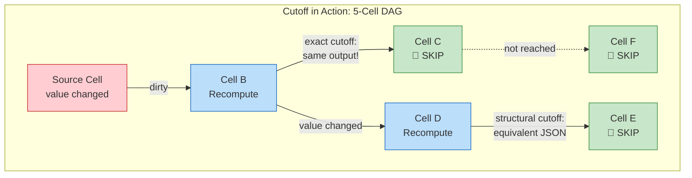

---

## 5. Computation DAGs — Formula Steps With Inputs/Outputs

Formula steps gain `inputs` and `outputs` declarations, enabling topological
scheduling and parallel dispatch.

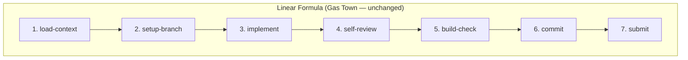

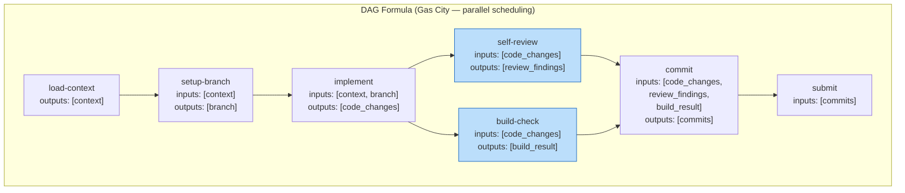

> Steps `self-review` and `build-check` (blue) execute in **parallel** — they
> share the same input (`code_changes`) but are independent of each other.

---

## 6. Parallel Scheduling Rules

How the DAG scheduler decides which steps to dispatch.

```mermaid
stateDiagram-v2
    [*] --> Pending: Step created

    Pending --> Eligible: All inputs satisfied
    Pending --> Blocked: Missing inputs

    Blocked --> Eligible: Upstream step completes

    Eligible --> Running: Polecat dispatched
    Eligible --> Skipped: Inputs unchanged (cutoff)

    Running --> Completed: Step succeeds
    Running --> Failed: Step errors

    Completed --> [*]: Output available for downstream
    Skipped --> [*]: Cached output reused
    Failed --> [*]: Downstream steps NOT dispatched
```

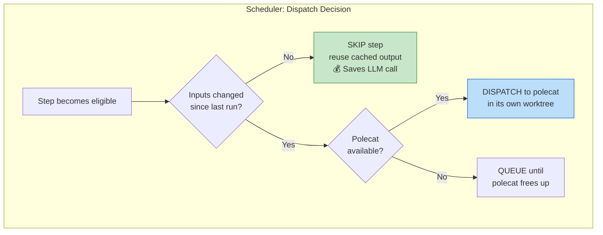

---

## 7. Bounded Cycle Unrolling

DAGs cannot express true cycles. Reflection loops (implement -> review -> revise)
are handled by bounded unrolling with a convergence predicate.

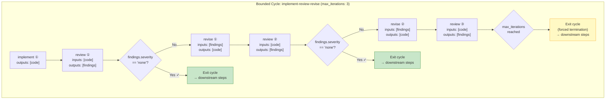

---

## 8. Dynamic Dependency Discovery

A cell's true dependencies are discovered at evaluation time, not declared
statically. The evaluator records which cells it reads during execution.

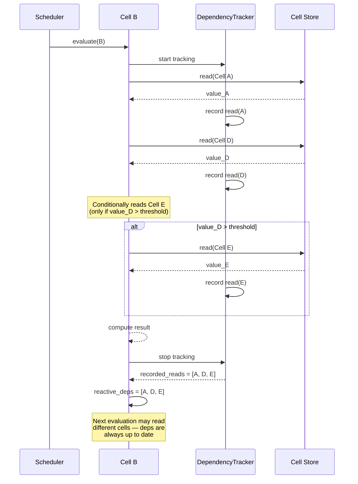

---

## 9. Multi-Agent DAG Execution

Each step dispatches to exactly one polecat. Parallelism happens at the step
level across polecats, not within a single step.

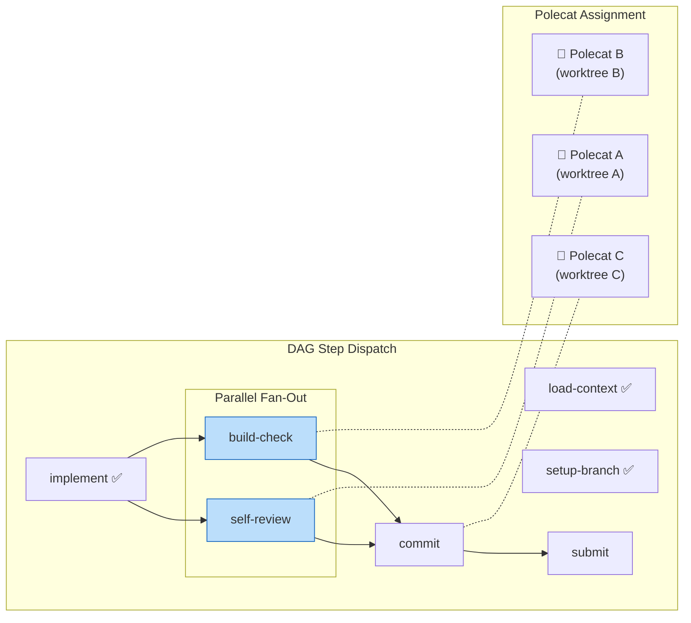

---

## 10. The Inverted Cost Model

Gas City's reactive computation operates under fundamentally different cost
assumptions than traditional reactive systems.

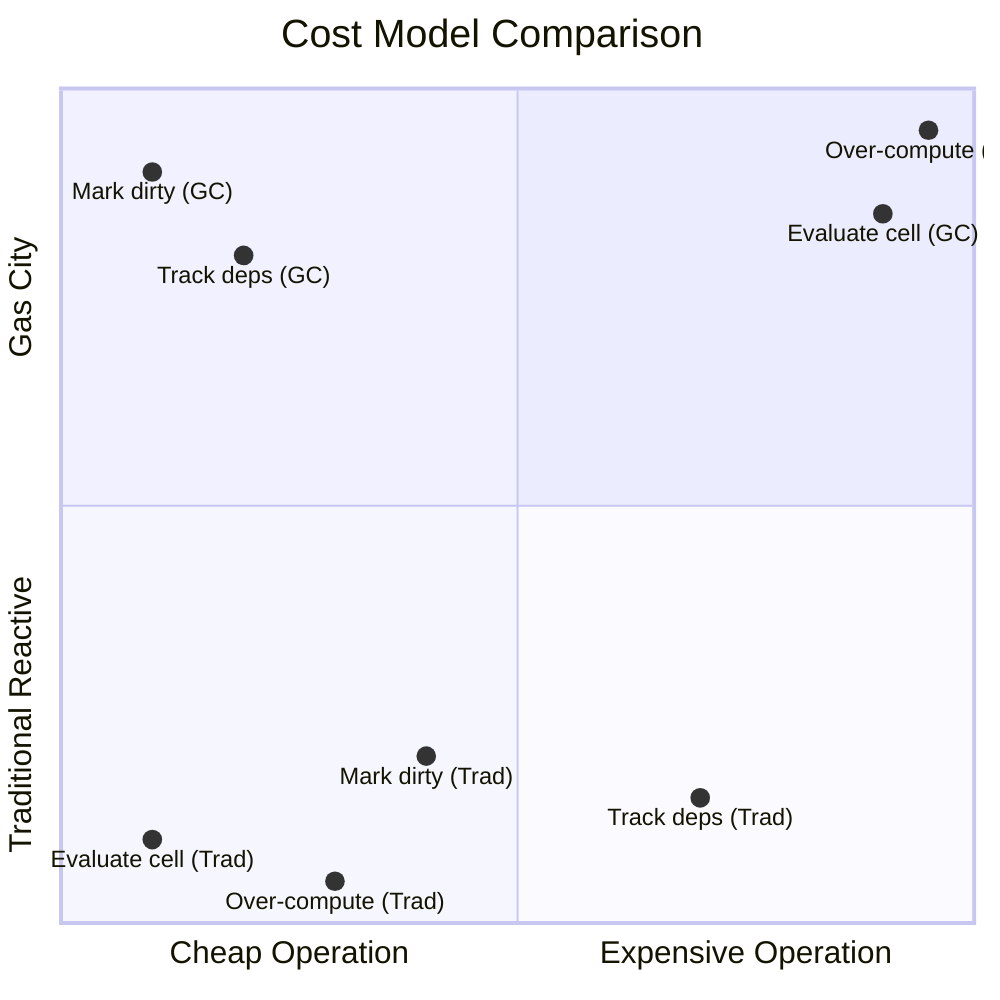

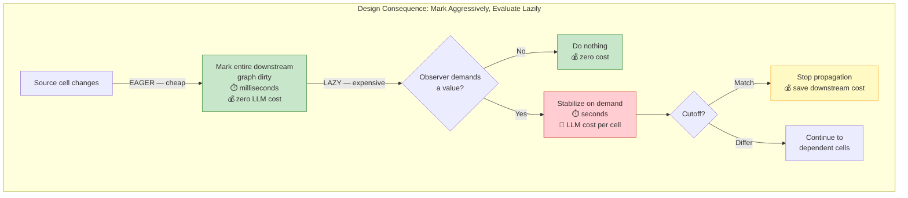

---

## Sources

- S3: Architecture Sketch — What Gas City Adds (§2.1 Reactive Cells, §2.2 Computation DAGs)
- R2: Reactive Dataflow and Incremental Computation
- Adapton: Composable, Demand-Driven Incremental Computation (Hammer et al.)
