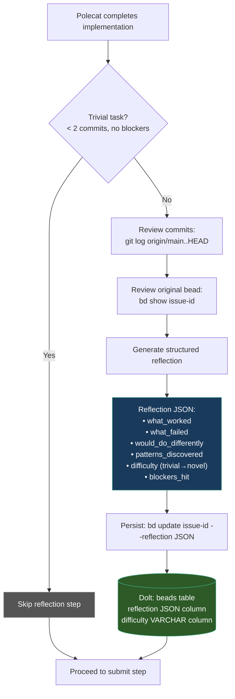
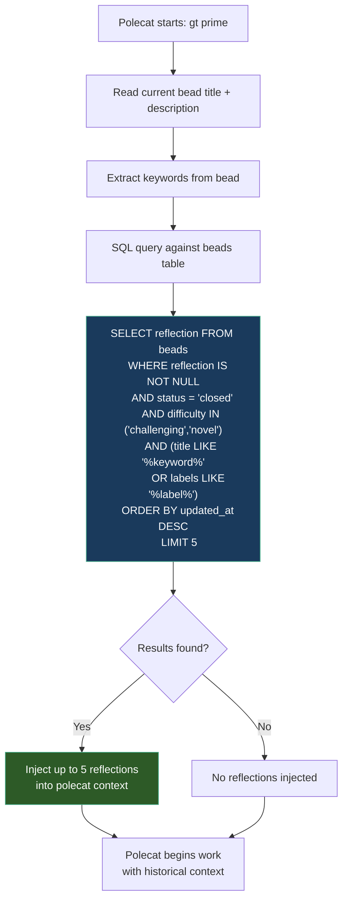
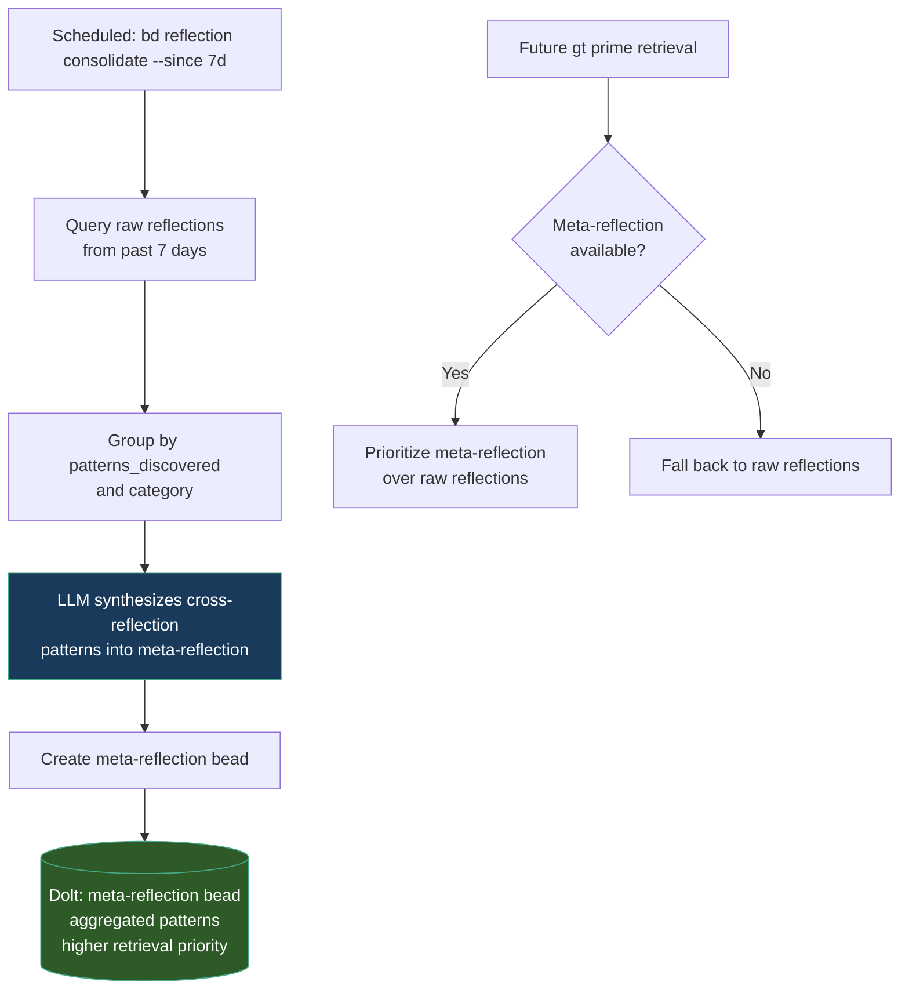
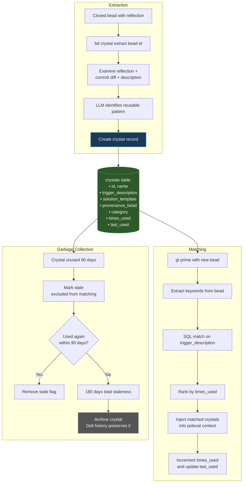
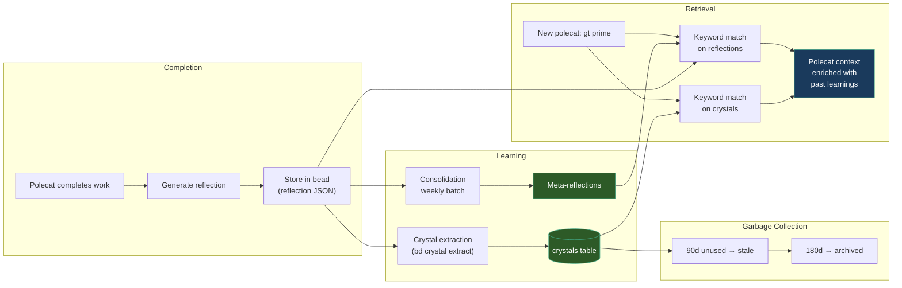
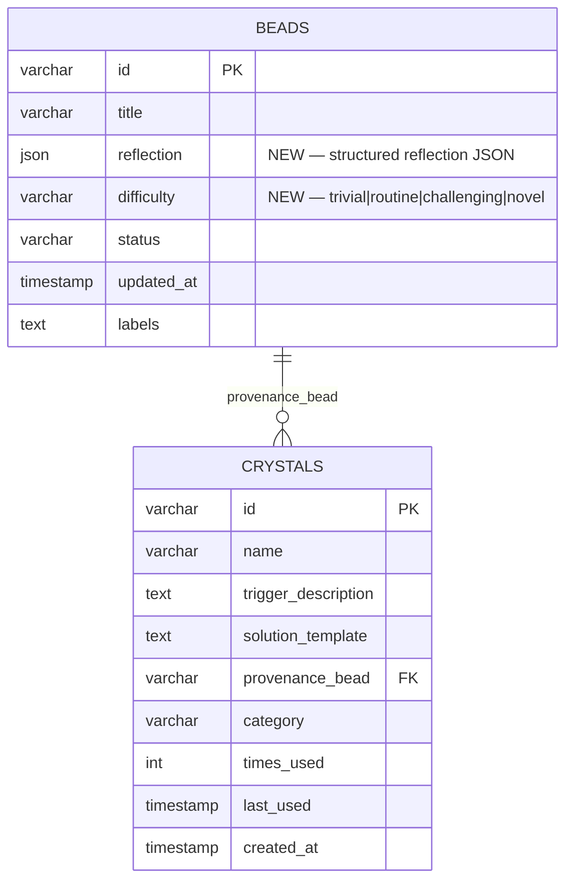
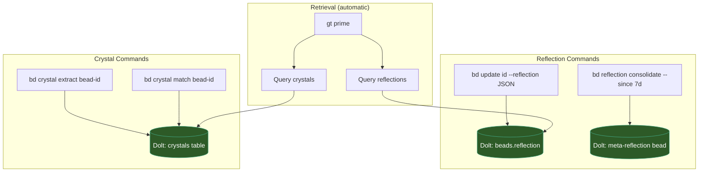

# Layer 2: Learning Pipeline — Mermaid Diagrams

**Source**: S3 Architecture Sketch, Sections 3.1 (Reflection Cycles) and 3.2 (Skill Crystals)

---

## 1. Reflection Generation Flow

How a polecat generates a structured reflection after completing work.

---

## 2. Reflection Retrieval During `gt prime`

How past reflections are surfaced to a new polecat at session start.

---

## 3. Reflection Consolidation

Periodic synthesis of raw reflections into higher-level meta-reflections.

---

## 4. Skill Crystal Extraction and Lifecycle

How crystals are born from completions, matched during prime, and garbage-collected.

---

## 5. Full Learning Pipeline — End-to-End

The complete data flow from polecat completion through reflection, crystal extraction, consolidation, and retrieval.

---

## 6. Schema Changes Summary

---

## 7. CLI Command Flow

