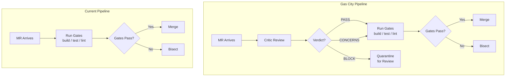
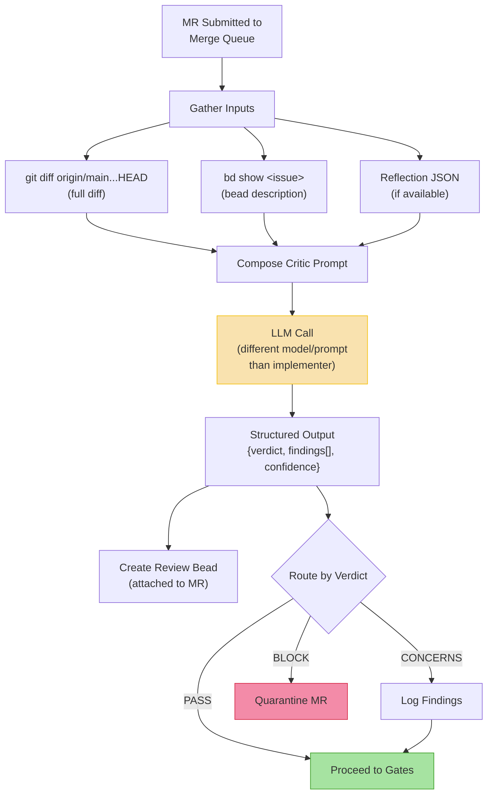
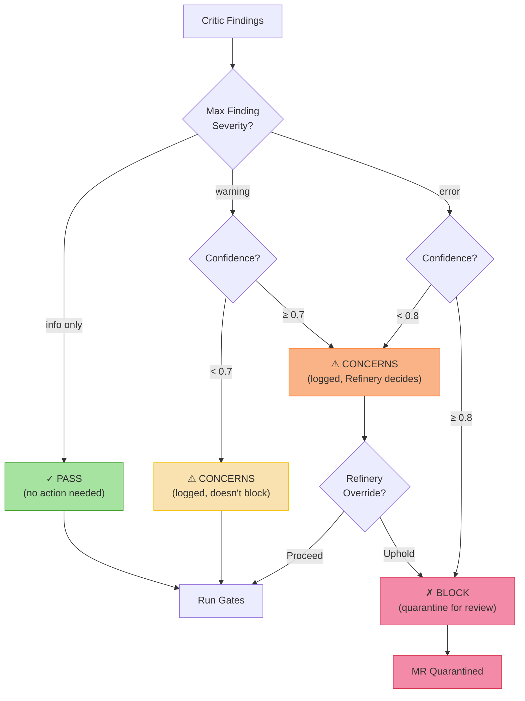
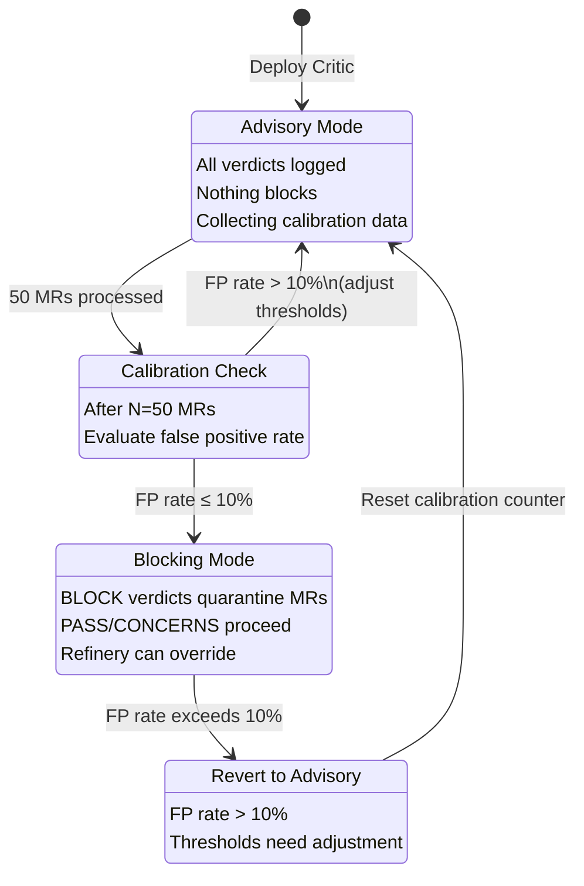
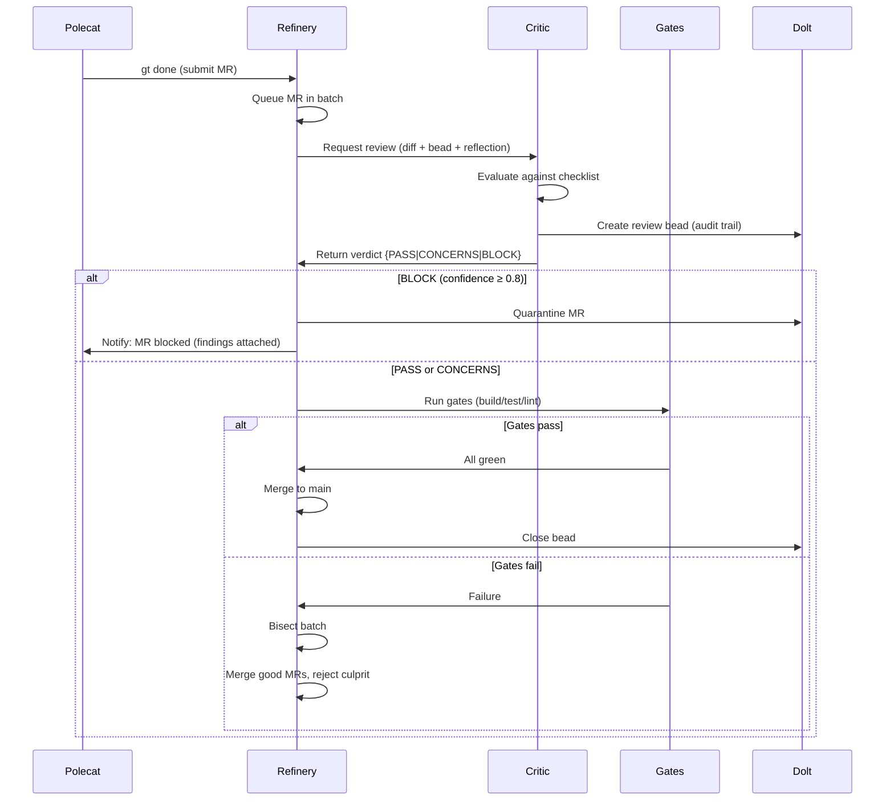
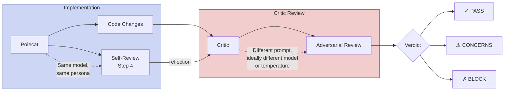
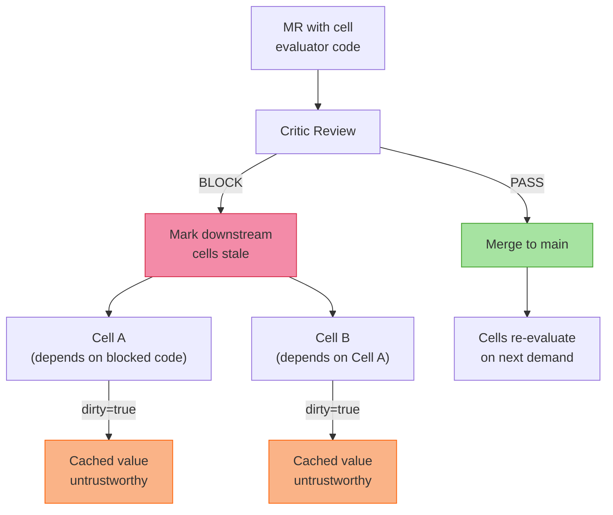

# Layer 3: Quality Gate — Critic Lens Diagrams

**Source**: S3 Architecture Sketch §4.1 (Critic Lens)

---

## 1. Refinery Pipeline: Current vs Gas City

Shows how the Critic Lens inserts before expensive gates.

---

## 2. Critic Review Process

End-to-end flow of a single Critic review — inputs, evaluation, outputs.

---

## 3. Verdict Threshold Decision Matrix

How findings map to verdicts based on severity and confidence.

---

## 4. Advisory vs Blocking Mode Lifecycle

The Critic starts advisory and graduates to blocking after calibration.

---

## 5. Full MR Lifecycle with Critic Lens

Complete flow from polecat submission through merge or rejection.

---

## 6. Critic Independence Architecture

Why the Critic must be independent from the implementing polecat.

---

## 7. Cross-Layer Interaction: Critic ↔ Reactive Cells

When a Critic BLOCKs an MR, downstream reactive cells are affected.

